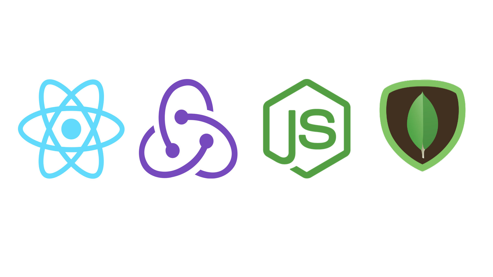

# Routinium

<center>The best of the best when it comes to habit tracking.</center>

### Core Tech Stack



### Installation

Install all of the project dependencies.

```bash
npm install
```

Install backend packages.

```bash
cd backend/
npm install
```

Production build

```bash
npm run build:prod
```

### Development

Start the development server.

```bash
npm start
```

Build a development version.

```bash
npm run build:dev
```

Start backend.

```bash
cd backend/
node server.js
```

### Dependencies

** Dependencies **

```
 - react
 - react-dom
 - redux
 - lodash
 - sass
 - bootstrap
 - jquery
 - popper.js
```

** Developer Dependencies **

```
 - react-redux
```

** Loaders / Webpack Dependencies **

```
 - @babel/core
 - @babel/preset-env
 - @babel/preset-react
 - babel-loader
 - css-loader
 - html-webpack-plugin
 - sass-loader
 - url-loader
 - webpack
 - webpack-cli
 - webpack-dev-server
 - svg-inline-loader
```
